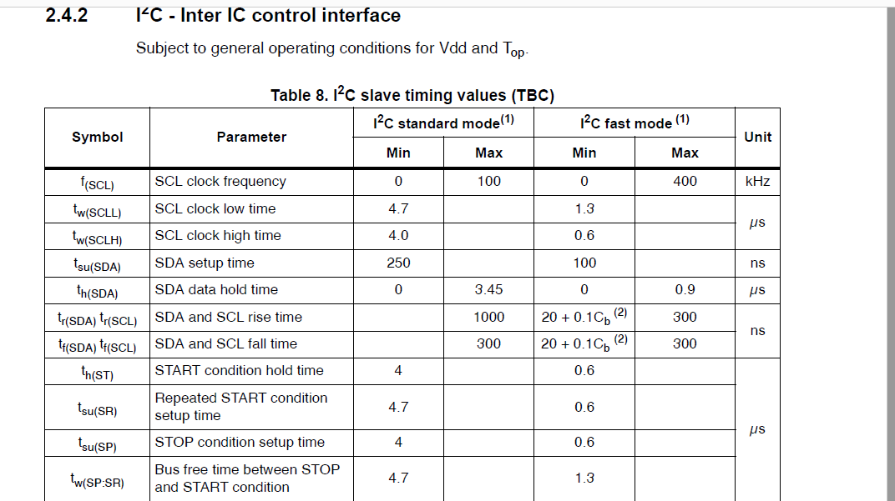
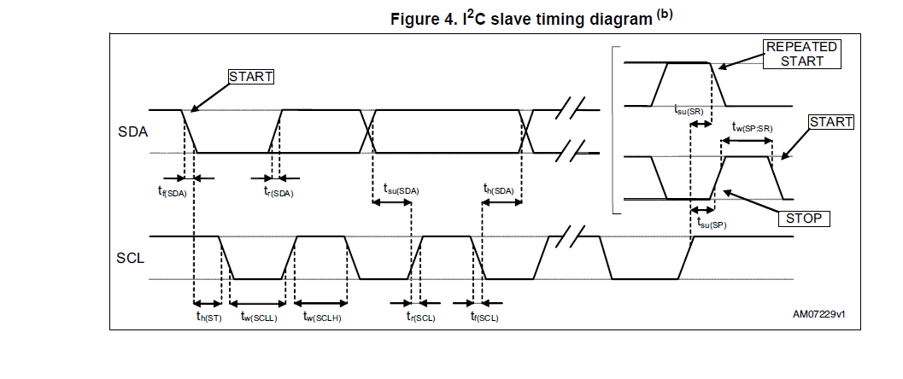
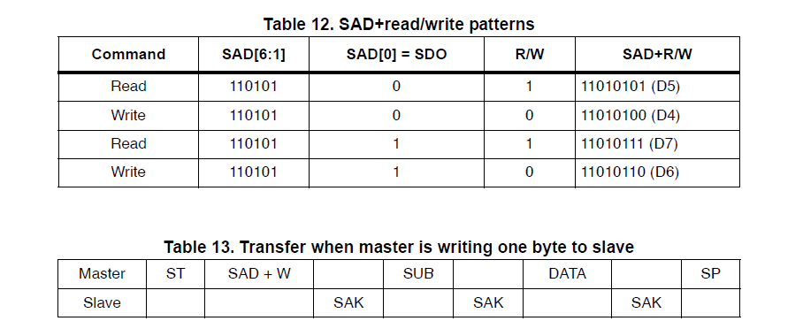
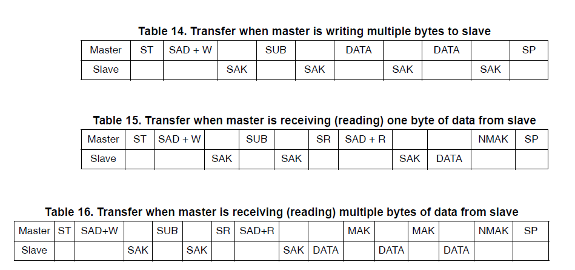
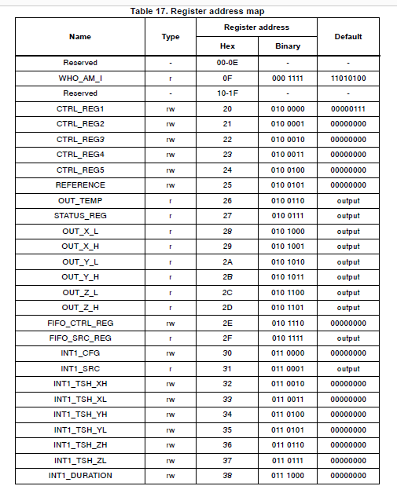

# UART Protocol

```
USART steps:

void init(void){

enable rcc clock (if rcc exists in the mcu)

enable the uart

set the baudrate (calculate it or choose from the lookup table)

set the number of stop bits (1/2)

set the parity bit config (enabled/disabled)

set the data length (8 or 9) (optional)

set the transmission complete interrupt (enabled/disabled) (optional)

set the receive buffer not empty interrupt (enabled/disabled) (optional)

set the Tx pin as alternate function 

enable the transmitter

set the Rx pin as alternate function

enable the receiver

}


void transmitByte(unsigned char byte){
DR = byte;

poll over transmission complete flag (break the loop when the flag equal 1)
this step is for multiple transmission, becuase you can't exit this function 
without ensuring the completion of transmissio

}

unsigned char receiveByte(void){
poll on the receive buffer not empty flag, exit the loop when the flag is set, that means that the uart received some data and it's ready to read now

return DR;
}

void sendString(unsigned char* str){

int i = 0;

/* loop over the string until it reaches the end of the string, which is garuanteed to be '\0' */
while(str[i] != '\0'){

transmitByte(str[i]);

i++;
}

}
```

### stm32f401xc

```c
void init(void){
    RCC_APB2ENR |= (1 << 4);        /* enable clock */

    USART1_CR |= (1 << 13);     /* enable uart1 */

    /* to set baudrate to 115200 bits/sec, we need to set USART1_BRR = 8.6875 */
    unsigned int mantissa = 8;
    unsigned fraction = floor(16 * 0.6875);
    
    USART1_BRR = (mantissa << 4) | (fraction << 0);

    USART1_CR2 |= (0b01 << 12);     /* 0.5 stop bit (which is 1 stop bit in actual transmission, this is noted in the datasheet)

    USART1_CR1 &= ~(1 << 10);       /* disable parity */

    USART1_CR1 &= ~((1 << 4) | (1 << 5) | (1 << 6) | (1 << 7) | (1 << 8));      /* disable all interrupts */

    /* selecting AF7 alternate function in PA9 and PA10 to work as TX, RX */
    GPIOA_AFRH |= (0b0111 << 4) | (0b0111 << 8);

    /* enable both trnsmitter and receiver */
    USART1_CR1 |= (1 << 3) | (1 << 2);
}

void transmitByte(unsigned char byte){
    USART1_DR = byte;

    while(!(USART1_SR & (1 << 6))){}

}

unsigned char receiveByte(void){
    while(!(USART1_SR & (1 << 5))){}

    return UART1_DR;
}

void sendString(unsigned char* str){

    int i = 0;

    while(str[i] != '\0'){

        transmitByte(str[i]);

        i++;
    }

    transmitByte('\0');

}

```

how to interface HC-05 using the above driver

> note: always, the response of the HC-05 to the mcu ends with **'\r\n'**, and your messeges also must end by '\r\n' to be able for the module to understand you

> important note: HC-05 initially communicate using **baud rate 38400**, so this must be edited in the **init()** function (lookup the corresponding USART1_BRR value to setup the new baudrate)

**see the datasheet for all the AT commands**

how to check that the communication is set up?
```c

unsigned char recvBuffer[100];
unsigned int num_of_recv_data = 0;

int main(void){
    init();

    sendString("AT\r\n");

    unsigned char recv;
    unsigned char previous_recv;
    unsigned int current_recv_idx = 0;

    while(1){
        if(num_of_recv_data == 0){
            recv = receiveByte();

            /* put the received data (8 bits) in the receiving buffer */
            recvBuffer[current_recv_idx] = recv;
        }
        if(num_of_recv_data > 0){
            previous_recv = recv;
            recv = recieveByte();

            /* put the received data (8 bits) in the receiving buffer */
            recvBuffer[current_recv_idx] = recv;
            if(recv != '\n' && pervious_recv == '\r'){
                /* this is the end of the response */
                /* check now for the full content */
                if(string_compare(recvBuffer, "OK\r\n")){
                    /* things is OK */
                }
                else{
                    /* communication had failed */
                }
            }
        }
    }

}
```

how to Delete All Authenticated Device?

```c
int main(void){
    init();
    /* just by sending the AT command that is responsible for this */
    sendString("AT+ RMAAD\r\n");

    while(1)
    {
        /* same code that checks that the response is OK */
    }
}
```

how to connect a new device?

```c
int main(void){
    init();
    sendString("AT+LINK=1234,56,abcdef\r\n");

    while(1){
        /* same code that checks that the response is OK */
    }
}
```

how to inquiry bluetooth devices?

like this example

```
Example:
AT+INIT\r\n
OK
AT+IAC=9e8b33\r\n
OK
AT+CLASS=0\r\n
AT+INQM=1,9,48\r\n
At+INQ\r\n
+INQ:2:72:D2224,3E0104,FFBC
+INQ:1234:56:0,1F1F,FFC1
+INQ:1234:56:0,1F1F,FFC0
+INQ:1234:56:0,1F1F,FFC1
+INQ:2:72:D2224,3F0104,FFAD
+INQ:1234:56:0,1F1F,FFBE
+INQ:1234:56:0,1F1F,FFC2
+INQ:1234:56:0,1F1F,FFBE
+INQ:2:72:D2224,3F0104,FFBC
OK
```

hint: this example uses a combination of AT commands not just the inquiry command (AT+INQ\r\n)


```c

unsigned char recvBuffer[1000];
unsigned int num_of_recv_data = 0;


unsigned char response_is_OK(void){

    if(num_of_recv_data == 0){
        recv = receiveByte();

        /* put the received data (8 bits) in the receiving buffer */
        recvBuffer[current_recv_idx] = recv;
    }
    if(num_of_recv_data > 0){
        previous_recv = recv;
        recv = recieveByte();

        /* put the received data (8 bits) in the receiving buffer */
        recvBuffer[current_recv_idx] = recv;
        if(recv != '\n' && pervious_recv == '\r'){
            /* this is the end of the response */
            /* check now for the full content */
            if(string_compare(recvBuffer, "OK\r\n")){
                /* things is OK */
                return 1;
            }
            else{
                /* communication had failed */
                return 0;
            }
        }
    }
}

unsigned char recv_the_query_is_OK(void){

    if(num_of_recv_data == 0){
        recv = receiveByte();

        /* put the received data (8 bits) in the receiving buffer */
        recvBuffer[current_recv_idx] = recv;
    }
    if(num_of_recv_data > 0){
        previous_recv = recv;
        recv = recieveByte();

        /* put the received data (8 bits) in the receiving buffer */
        recvBuffer[current_recv_idx] = recv;
        if(recv != '\n' && pervious_recv == '\r'){
            /* this is the end of the response */
            /* check now for the full content */
            if(string_compare(recvBuffer + (current_recv_index - 4), "OK\r\n")){
                /* things is OK */
                return 1;
            }
            else{
                /* communication had failed */
                return 0;
            }
        }
    }
}

int main(void){
    init();

    unsigned char recv;
    unsigned char previous_recv;
    unsigned int current_recv_idx = 0;

    sendByte("AT+INIT\r\n");

    while(1){

        if(response_is_OK()){
            sendByte("AT+IAC=9e8b33\r\n");

            if(response_is_OK()){
                sendByte("AT+CLASS=0\r\n"); /* this command have no response */
                sendByte("AT+INQM=1,9,48\r\n"); /* this command have no response */
                sendByte("At+INQ\r\n");
                if(recv_the_query_is_OK()){
                    /* process and parse the recvBuffer array */
                    /* from now on, this is main application code */
                }
            }
            else{
                sendByte("AT+IAC=9e8b33\r\n");    /* resend */
            }
        }
        else{
            sendByte("AT+INIT\r\n");    /* resend */
        }

    }
}
```


# SPI protocol

```
void init(void){

    enable RCC clock

    choose the mode (master/ slave)

    if slave, setup the slave address

    choose the frequency of the CLK pin

    setup CLK polarity (0 or 1)

    setup CLK phase (0 or 1)

    setup data order (LSB first / MSB first)

    setup interrupts (enable what you need)

    set MOSI, MISO, CLK as alternate functions for SPI

    init SS pin as GPIO output push-pull for slave select

    enable SPI
}

void transmitByte(unsigned char byte){
DR = byte;

poll over transmission buffer empty flag (break the loop when the flag equal 1)
this step is for multiple transmission, becuase you can't exit this function 
without ensuring the completion of transmission

}

unsigned char receiveByte(void){
put some dummy byte in the DR to begin data receiving

poll on the receive buffer not empty flag, exit the loop when the flag is set, that means that the uart received some data and it's ready to read now

return DR;
}

void sendString(unsigned char* str){

int i = 0;

/* loop over the string until it reaches the end of the string, which is garuanteed to be '\0' */
while(str[i] != '\0'){

transmitByte(str[i]);

i++;
}

}
```

in **stm32f401xc**

```c

void init(void){

    enable RCC clock

    SPI_CR1 |= (1 << 2);    /* select Master Mode */

    /* choose the frequency of the CLK pin */
    /* assuming that Fclk = 16MHZ */
    SPI_CR1 |= (0b011 << 3);    /* frequency of the spi transmission is now Fclk/16 which is 1MHZ */

    /* select CLK polarity and phase */
    SPI_CR1 &= ~((1 << 1) | (1 << 0));

    SPI_CR1 &= ~(1 << 7);       /* MSB first, this is selected based on sensor's timing diagram */

    set MOSI, MISO, CLK as alternate functions for SPI

    /* init SS pin as GPIO output push-pull for slave select */
    GPIO_init('A', PIN0, OUTPUT, PUSH_PULL);        /* random pin */

    SPI_CR1 |= (1 << 6);    /* enable the SPI */
}

void transmitByte(unsigned char byte){
    SPI_DR = byte;

    while(!(SPI_SR & (1 << 1))){}
}

unsigned char receiveByte(void){
    SPI_DR = 0x00;
    
    while(!(SPI_SR & (1 << 0))){}

    return SPI_DR;
}

void sendString(unsigned char* str){
    int i = 0;

    while(str[i] != '\0'){

        transmitByte(str[i]);

        i++;
    }

}
```


**this driver can be used as the previous UART driver to interface the HC-05, as the HC-05 support both protocols**

> we can reuse the previous interfacing because UART and SPI have the same function's names (APIs) with same functionalities

# I2C

you will find implemetation steps <a href="https://docs.google.com/document/d/1EDZQyuwUMtNuidyUDq8bQhMS0XaVNKcrUy1FszSb1IQ/edit?usp=sharing"> here </a>

in **stm3f401xx**

```c
#define I2C1_RCC_EN() (RCC->APB1ENR |= RCC_APB1ENR_I2C1EN_Msk)
#define I2C1_AF_EN() (GPIOB->AFR[0] |= (0x44 << (6 * 4)))

#define GENERATE_STOP()  	(I2C1_CR1 |= (1<<9))
#define GENERATE_START() 	(I2C1_CR1 |= (1<<8))

void I2C_MasterInit(void)
{
	GPIO_EnableClk(PORTB);
	// add pull-up resistor in HW connections
	GPIO_Init(PORTB, PIN6, ALTERNATE_FUNCTION_OD, VERY_HIGH_SPEED);// clk
	GPIO_Init(PORTB, PIN7, ALTERNATE_FUNCTION_OD, VERY_HIGH_SPEED);// SDA

	I2C1_AF_EN();// bind I2C pins to io pin

	I2C1_RCC_EN(); // enable RCC clk

	/* peripheral input clock in I2C_CR2 Register */
	I2C1_CR2 = 16; // 2MHz clock

	I2C1_CCR = 80; // T_clk(high)= T_PCLK1 * 1  T_clk(low)= TP_CLK1 * 1

	I2C1_TRISE = 17; // from the equation in data sheet see section 18.6.9

	// select the 7-bit addressing mode
	I2C1_OAR1 &= ~(1<<14);

	I2C1_CR1 |= (1<<1); // peripheral enable

}

/* function sends the start condition */
void I2C_start(void){
    GENERATE_START();
	while (!(I2C1_SR1 & 0x01));// wait the SB flag to be set
}

/* function sends the stop condition */
void I2C_stop(void){
	GENERATE_STOP();
}

/* this function return garbage: don't care */
unsigned char I2C_writeAddressForWriteOp(unsigned char addr){
	I2C1_DR = (addr << 1);
	while (!(I2C1_SR1 & 0x02));// wait the ADDR flag to be set

	/* Flag cleared by reading two registers */
	return I2C1_SR1, I2C1_SR2;
}

/* this function return garbage: don't care */
unsigned char I2C_writeAddressForReadOp(unsigned char addr){
	I2C1_DR = (addr << 1) | 0x01;
	while (!(I2C1_SR1 & 0x02));// wait the ADDR flag to be set

	/* Flag cleared by reading two registers */
	return I2C1_SR1, I2C1_SR2;
}

void I2C_writeByte(unsigned char byte)
{
    I2C1_DR = byte; // write DR to transmit the data
    while (!(I2C1_SR1 & (0x01 << 7))); // wait until flag (TX empty) is set
}

/* function to check if the ACK had been received or NACK */
unsigned char I2C_isRecvACK(void){
    /* check the Byte transfer finished flag, this flag is set upon ACK reception and not set upon NACK reception */
    return (I2C_SR1 & (1 << 2));
}


/* function to return the data received and send an ACK to the transmitter */
unsigned char I2C_readByteAndSendACK(void){
    I2C1_CR1 |= (1<< 10); // enable ACK sending after the RxNE is set

    while(!(I2C1_SR1 & (1 << 6))); // wait receive not empty (RxNE) flag to be set

    return I2C1_DR;
}

/* function to return the data received and send an NACK to the transmitter */
unsigned char I2C_readByteAndSendNACK(void){
    I2C1_CR1 &= ~(1<< 10); // disable ACK sending after the RxNE is set

    while(!(I2C1_SR1 & (1 << 6))); // wait receive not empty (RxNE) flag to be set

    return I2C1_DR;
}
```

consider this sensor (L3GD20)





> The Slave ADdress (SAD) associated with the L3GD20 is 110101xb.



this is how to use I2C to interface it to write to **CTRL_REG5** and read from **OUT_X_L up to OUT_Z_H**

```c

unsigned char SAD = 0b110101;

void L3GD20_init(void){
    I2C_init();     // setup for 100KHZ or 400KHZ (from the first table first column in L3GD20 datasheet)
}
void L3GD20_write(unsigned char data){
    I2C_start();    /*  start bit */

    I2C_writeAddressForWriteOp(SAD << 1);     /* send the addr like the datasheet state */

    /* wait 1 ms then check the response state */
    delay_ms(1);
    if(!I2C_isRecvACK()){
        /* connection failed */
        return;
    }

    I2C_writeByte(0x24 | (0 << 7));      /* SUB of CTRL_REG5 register in L3GD20, and resetting the MSB of the SUB to disable the auto increment */

    /* wait 1 ms then check the response state */
    delay_ms(1);
    if(!I2C_isRecvACK()){
        /* connection failed */
        return;
    }

    I2C_writeByte(data);        /* the value which will be written to CTRL_REG5 */
    
    /* wait 1 ms then check the response state */ 
    delay_ms(1);
    if(!I2C_isRecvACK()){
        /* connection failed */
        return;
    }

    I2C_stop();     /* stop bit */
}

void L3GD20_read(unsigned char* recvBuffer, unsigned char size){
    I2C_start();    /*  start bit */

    I2C_writeAddressForWriteOp(SAD << 1);     /* send the addr like the datasheet state */

    /* wait 1 ms then check the response state */
    delay_ms(1);
    if(!I2C_isRecvACK()){
        /* connection failed */
        return;
    }

    I2C_writeByte(0x28 | (1 << 7));      /* SUB of OUT_X_L register in L3GD20, and setting the MSB to enable the auto increment (to cover the6 registers up to OUT_Z_H) */

    /* wait 1 ms then check the response state */
    delay_ms(1);
    if(!I2C_isRecvACK()){
        /* connection failed */
        return;
    }

    I2C_start();    /*  repeat start bit */

    I2C_writeAddressForReadOp(SAD << 1);     /* send the addr like the datasheet state */

    /* wait 1 ms then check the response state */
    delay_ms(1);
    if(!I2C_isRecvACK()){
        /* connection failed */
        return;
    }

    unsigned int i = 0;
    /* read the first five registers and send ACK */
    for(i = 0; i < size - 1; i++){
        recvBuffer[i] = I2C_readByteAndSendACK();
    }

    /* read the last register and send NACK */
    recvBuffer[i] = I2C_readByteAndSendNACK();

    I2C_stop();     /* stop bit */
}
```