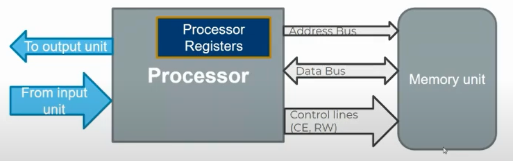
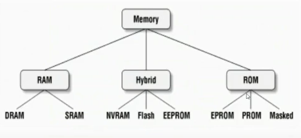

## lecture 1 notes

a typical Computer hardware consist of three main components, ```cpu```, ```Memory```, ```IO``` and ```peripherals```. as well as Microcontrollers which we will focus on

### why need peripherals at the first place?
* each peripheral can be programmed and run in Parallel manner with cpu and other peripherals, because at the end, a peripheral is nothing other than **hardware circuit** outside the cpu and separated from other peripherals Functionalities.
* fewer Code to store in the Flash Memory (i.e. **Memory conservation**).
* Faster than Code. bacause a peripheral is a **programmable dedicated hardware** for specific functionalities and this is always faster than doing this Functionalities using general purpose Cpu.
* even if we use real time operating system to handle perihperals functionalities with code in separate threads, it's still **sequential execution** of the code not in parallel manner. **C language cannot run actual parallel threads**

for example, suppose I want to send 8 bits data output from Mcu Pin serially to another Mcu
* with code
```c 
void send_bits(unsigned char data){
    while(data != 0x00){
        /* put the first bit of data variable in the Pin*/

        /* shift data variable to the right by 1*/

        /* wait some timing before entering the next loop */
    }
}

/* rest of your code */
```
* but if we program **UART** peripheral to do this by itself without any code, all we have to do is to tell it what is the data to be sent and it will send it for you according to your programmed configurations
```c
UART_config(/* pointer to configs*/);
UART.DR = data;     /* this will be sent by UART automatically */

/* rest of your code */
```

### why need Memory? 
* store the code in **FLASH** Memory or soCalled **ROM**
* store program data for execution in **RAM** Memory, this is temporary data that can be replaced by any value

how the CPU controls the **RAM**/**ROM** and **IO** or **peripherals** in general?
* CPU deals with Memory, and all of these have controllable registers that is mapped to certain addresses in the RAM, so processor can deal with them using the RAM interfacing with it becuase the user can W/R this type of registers, it's called **User-visible-registers** 
* there's some registers does not have any mapped addresses in the RAM so it cannot be controlled using RAM interface with CPU, usually these registers are reserved for controlling the operation of the processor, OS program access and privileged access only, but there're assembly instructions user can use to deal with em' directly. these registers are called **Control and status registers**

### how does the cpu inteface the Memory?



* read/write data using data Bus
* select the address using address Bus
* select the operation (R/W/enable/disable) from Control lines

> note: Memory is always **byte addressable**, so each byte have an address no other byte have

for example if I type ```int x = 0;``` this will be stored in the RAM with 4 addresses, bacause each byte of the ```int datatype (i.e. 4 bytes)``` have differest address. of course sequential addresses

Address bus width defines the Number of **bytes** or soCalled **locations** the CPU can access. if cpu have 2 bits address bus, then the addresses it can access is ```0b00```,```0b01```,```0b10``` and ```0b11```, which is **2 power n** where n is the address bus width.

ARM Cortex-M4 Processor have **32 bits Address bus**, that means that it can access 2 power 32 location which is **4,294,967,296** locations. of course STM32 Memories doesn't have all these locations, this number only defines the capability of the Memories the ARM cortex-M4 processors can afford. you can use this processor then to deal with any memory that does have number of locations no bigger than **4,294,967,296**.

we have referred to **location** as **byte** so far, but you need to know that this is not always true, there'some memories have the location equals **16 bits** or more, but the absolute thing is that it still **byte addressable**, means that each byte have a unique address and each location contain number of bytes with number of addresses, and the processor access each location at once to increase performance of reading and writing to the Memory

-----
### different types of memories


ROM memory is **Non volatile**, that means that it conserve the data stores in it even when the power is off.

Hybrid memory is **Non volatile** and **writable for Multiple times**

RAM is a **volatile** Memory for temporal data storage, Faster in Reading Memory locations More than ROM and Hybrid Memories

type | discription
-----|--------------------------
Masked ROM | have a specific hardware design (unchangable) circuit <br> so the user cannot write any code other than the existing one
PROM | have a modifiable hardware desgin (unchangable)circuit <br> it's considered One time Programmable Memory (OTP ROM) as it's delivered to the user fully erased and the user can modify the circuit design using circuit fuses (e.g. zener diodes) Only Once
EPROM | erasable One time programmable ROM <br> Memory cells based on **Floating gate transistors**, A bit's 0 or 1 state depends upon whether or not the floating gate is charged or uncharged. When electrons are present on the floating gate, current can't flow through the transistor and the bit state is 0, This is the normal state for a floating gate transistor, when a bit is programmed. When electrons are removed from the floating gate, current is allowed to flow and the bit state is 1.<br> usually it's erasable by **UltraViolet**
EEPROM | same structure as EPROM <br> but erasable by **Electricity (high Voltage)** <br> and can be programmed Multiple times <br> usually used in **runTime** when we need to save non-volatile data
FLASH EEPROM | same as EEPROM <br> but it's Block (number of locations) accessable and erasable <br> Typically Faster than EEPROM for large data storage like Code binaries. <br> not preferred to use in runtime
NVRAM | it's the same as RAM volatile circuits but with transient power supply that remains one when the main power is off to prevent erasing of the Memory values.
DRAM | volatile memory based on **capacitors**, chardged state means bit state 1, uncharged state means bit state 0.<br> usually used when we care about storage capacity not access performance, used in **external Memory**
SRAM | based on **transistors**,  have automatic refreshing circuit<br> usually used when we care of access performance over than storage capacity, used in **registers, RAM, cache and IO**


comparison | SRAM | DRAM
-----|------|----------
based on | 6 **transistors** @ the cell circuit| one **capacitor** @ the cell circuit
access time | lower | higher
cost | higher | lower
size | lower | higher
power consumption | lower(automatic refreshing circuit) | Much higher (refreshing circuits)


