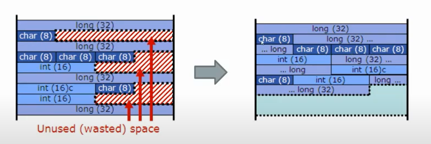
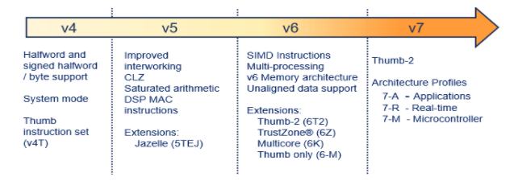
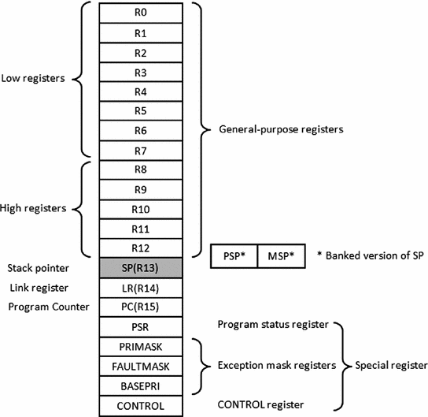

## lecture 2 notes

there's two types of architectures, **software architecture** and **hardware architecture**

**software architecture** which is the set of **instructions** used to perform different processor operations. e.g. ADD instruction to make the processor execute specific addition circuit for 2 operands. each instruction must have some hardware to support the execution of it, ADD needs addition circuit, Multipy needs multiplication circuit, DIV needs division circuit. if the instruction doesn't have specific instruction hardware, the **compiler** needs to translate the code into supported instructions sequence that perform the same operation.

binary output (executable hex file of the embedded software project) cannot be run in your laptop or any other device other than the target microcontroller target

how the exe application run in the computer?

any desktop application to be run in your computer, it needs to be stored in the RAM then move the PC (program counter) to the first instruction address to begin fetching the instructions and execute them. this whole process is performed by the Operating system i.e. windows, linux or whatever

each hardware have an ISA(instruction set architecture) which is defined with the following:
* supported datatypes. the datatypes of instructions operands
```c
    ADD R1, #0E0 /* this ADD instruction deals with 8 bits in AVR or 32 bits in ARM, or even can be floating point data with the existance of FPU. ISA defines which of these datatypes is used with each instruction */
```
* addressing modes
```c
ADD R1, #0x0E0
ADD R1, 0x0E0
ADD R1, @0x0E0
ADD R1, @R0
/* ISA defines which of these addressing modes you are using */
```
* Main memory and registers interface. the method which you interface the memory with.
* instruction set. which is the list of hardware supported instructions.
* input output model. what is the addresses that deal with the input output.

any computer have these types of instructions


some of these instructions are 

instruction|description | type of instruction
-------|--------------- | ------
mov | move data from anylocation to anylocation | data transfer
load | transfer from memory to registers | data transfer
store | transfer from registers to memory | data transfer
push and pop | to deal with stack | data transfer
inc | increment the data in specific address | Arithmetic
dec | decrement the data in specific address | Arithmetic
reminder | calculate the reminder | Arithmetic
and/or/xor/not | perform it's names job | Logical
jmp | jump the program counter to different location | Transfer of control
conditional jump instructions | jump on specific condition | Transfer of control
call | call specific function or subroutine | Transfer of control


* Logical and Arithmetic instructions affect the **status register**
* jmp instructions perform a jump with no turn back, call instructions perform a jump with returning back in consideration
* the memory you interface is either an **isolated memory** or **memory mapped**, memory mapped is when the registers from peripherals outside the cpu can be written and read from a specific address in the memory, the other type of memory is the ordinary one.

the binary outputs (machine code files) is stored in the program memory or as known as Flash in your microcontroller. to be executed in the microcontroller it must perform aa specific cycle. typically a **Fetch**, **decode** and **execute**

* Fetch, which is reading the instruction binary(Op code + operand1 + operand2) and store it in **IR** register
* decode, which is translating the instruction binary stored in the IR to hardware signals that processor circuits can understand
* execute, which is performing this translated signals using processor's hardware circuits, if it's executing Arithmetic or logical instructions, it will be executed in the ALU. if it's executing a data transfer, it would be executed with the memory interface. and so on

first step before executing any code is to update PC with the starting address of the stored machine code in the flash.

instruction binary typically is **OP code**, **src addr.** and **dest addr.**
so how the hardware (decoder) knows the addressing mode used in this instruction binary? there's a **bit field** responsible for **informing the decoder** with the addressing mode used, the compiler set this bit field when it translate the assembly into this binary code.

# ARM processor

* ARM are strongly adhered to speed, performance and power consumption
* typical cpu is consisted of ALU, registers, control unit(responsible of fetching and decoding)
* a typical processor is the same as CPU, but ARM added some internal peripherals to the typical CPU to form new brand processor. they added interrupt unit, timer, security unit, floating point unit and memory protection unit

<div align = "center">

</div>

* > why use ARM architecture and not design our own processor architectue for our own microcontroller? 
* > if we used a shared Architecture like ARM and made it **generic architecture** for mcu products, the ISA will be the same for all our microcontroller products, thus the same compiler, thus the same development tools, thus a strong community due to the large usage among all mcu products.

* > why ARM added internal peripherals?

* > ARM added the commonly used peripherals in any mcu like interrupt, timer, FPU, exc..,the code dealing with these peripherals is reusable among all the microcontroller ARM based.
* ARM offers Architecture design not physical Processor
* arm provided several versions of it's architectures untill now

<div align = "center">

</div>

* ARM offered two different architectures in **armv4** , **Classical ARM Arch** and **Thumb ARM Arch**, the main difference is the memory consumption of instructions binary. the classical arch had a rich and complex instructions set but all consumed 32 bits, so it didn't suite the low memory devices, while the Thumb arch uses lower number of instructions set with only 16 bits architecture. the decrease in the number of the instructions for Thumb arch affects the performance as there's fewer instructions to use, you must select which arch you will use by software, and only one you can use.
* in **armv5**, improved memory access time, new instructions for dealing with saturated arithmetic and DSP
* in **armv6**, introduced SIMD instructions (single instruction multiple data) to improve speed, so ADD operation will be typically as ```ADD R1, R2,R3,R4,R5``` instead of two operands, this reduced the memory consumption and execution speed. support unaligned data in the mamory to reduce memory consumption as shown in below figure. support multi-cores. introduces **Thumb-2** architecture, this is a combination of classical and Thumb archs with completely different OP codes to make the processor know well which instruction it will use, is it classical 32 bits or thumb 16 bits.

<div align = "center">

</div>

* in **armv7**, Thumb-2 is the only supported arch. introduced New **Architecture profiles**, for each target of the processor (mobile, microcntroller, real-time) comes a customized internal peripherals.

<div align = "center">

</div>

Arch profile | summary
-------|------------
7-A | used in Applications, have rich ISA, highly optimized for speed regardless the cost and more internal peripherals
7-R | used in Real-time, less internal peripherals, Real-time processing prepherals for image and video processing
7-M | used in microcontrollers, low power consumption, lower  performance and lower cost.

* these are different architecture profiles, not a version for the same architectures. they are 3 parallel design lines.

* ARM provides two types of Licenses, **Core License** which is the license to use ARM cores(which is the **layout files** ready to manufacture without the architecture design access) to create MCUs, CPUs and SOCs, just combining ARM cores with other parts to produce a complete device. the other type is **Architecture License** which is the license to use ARM Architecture design and ISA for designing their own cores, the new designed cores must comply fully with the ARM arch.
 # ARM Cortex M4 CPU

 * it's 32 bits architecture which means it's data bus is 32 bits width
 * RISC arch which means reduced instruction set computer but ARM is **advanced RISC** which is more complex that the traditional old RISC architectures.
 * have 16 internal registers( the CPU without other internal peripherals)
 * 3 stage pipeline with branch prediction. pipelining is the execution of fetch,decode,execution of instructions in parallel, which increase cpu's performance
 * load-store architecture

* registers from R0 to R15 are general purpose registers, R13 is used also as SP(stack pointer), R14 as LR(link register) and R15 as PC(program counter)
* general purpose registers commonly used for cpu's execution storage like the ACC(accumulator)
* R0 to R7 are **low registers** that deal with Thumb 16 bits instructions
* R8 to R15 are **high registers** that deal with Thumb 32 bits and 16 bits instructions
* **PSR** is the status register, you don't need to know the specific flag bits in it, it will be given if needed
* **PRIMASK, FAULTMASK, BASEPRI** are used for hardware exceptions and not covered here

<div align = "center">

</div>

## CPU  operating modes


* arm have 2 modes, **Handler mode** for executing interrupts only and **thread mode** for executing anyother code
* arm processors include **memory protection units (MPU)** peripheral which control the accessability of different memory sections
* typically there're two different access levels for MCU Memory , **privileged** and **unprivileged** access level. for now all you need to know is that unprivileged access level restrict the access of some memory sections using the MPU, while privileged access level can access any memory location in the MCU.
* arm have 2 states, **thumb state** which is sequential execution of the code (normal execution) and **debug state** which is for execution under control of debugger
* so that there's in your IDE a **run** button and a **run and debug** button. both are being executed in different processor states.

<div align = "center">

</div>

* > what is debug?
* > a debugger is a software tool deals with hardware tool called **emulator** to access the program and data memory of the microcontroller, so that your code execution will be controlled and viewed by the debugger software, which you are controlling from your IDE or any other software tool. for the MCU to be able to be debugged there's must be an **emulator** which deals with MCU hardware executing debugger's commands

* **Bit banding** is a very strong feature for ARM cortex M4 processors. bit banding is a feature for accessing individual bits of memory data using unique assigned address for each bit. of course this feature cannot be used for all memory bit, if used for all of them we will need 8 times our current memory to be able to access each bit with unique address. so that this feature is only applied for 1KB from RAM, and you have the decision to use it or not, this feature increase access speed and performance of bitwise assignments which is common in embedded softwares.

## memory architecture of the ARM cortex M4 processor


* remember that ARM does not manufacture hardware, but it design architectures, including it's Memory architecture, without a physical memory manufactured, this is left for the MCU vendor
* memory architecture is what defines the memory that's interfaced with the cpu, define the **address space** used and memory sections and each section's address space (from some address to some address) and  so on
* the vendor must imply to this memory architecture when putting each physical memory section, so that each section must be implaced in it's address space
* you can find more detailed architecture in the datasheet, you needn't remember the addresses, it's in a lookup table in the datasheet.

<div align = "center">

</div>