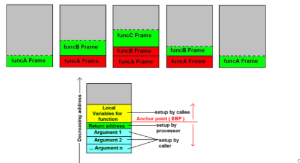

# C functions

> **Note**: switch case is preferable over if-else statements due to it's **assembly optimization**
switch case is considered a lookup table, calculated in compilation time before runtime. use cases can be found here : https://www.geeksforgeeks.org/switch-vs-else/

functions are used for 
* complexity reduction, devide your system into subsystems into software components into functions
* Abstraction, you can interface the function without understanding it's code implementation
* reusability
* parallism(independent functions so each function can be developed seperately)

a function have 3 forms:
* prototype or declaration
* implementation or definition
* invokation or calling

a **prototype** is essential for the compiler to make in consideration that some function is used in it's file but absolutely defined in another file, this prototype is used to inform the compiler with 3 information of the used function to check, **function name**, **return type** and **number of arguments**

for example, this code will pass the compilation stage and reach the linking stage, but the linker will not find the promised implementation of the ```add``` function in any other linked files so it will throw a linking error ```undefined reference to "add"```
```c
#include"stdio.h"
int add(int x, int y);

int main(){

    int z = add(5, 7);
    return 0;
}
```
```
main.c:(.text+0x17): undefined reference to `add'
collect2: error: ld returned 1 exit status
```
so to solve this problem you need to type the **definition** or implementation of the ```add``` function

```c
#include"stdio.h"

int add(int x, int y); /* prototype */
// int add(int, int); /* also allowed prototype */

int main(void){
    int z = add(5, 7); /* invokation of the function */
}

int add(int x, int y){
    return x + y;
} /* definition */

```
the add function definition can be: 
* In the same file from where it will be invoked
* In another file from where it is invoked
* In a library compiled and linked to the function invoking it 

**implicit declaration**, this is an automatic prototype generated by compiler if no prototype for the used function exist, this may result in unwanted errors because the assumption prototype may not be compatible with the definition of the function, and **ignore the check of the number of function arguements**
```c
#include"stdio.h"

int main(void){
    int z = add(5, 7);
    return 0;
}

int add(int x, int y){
    return x + y;
}

```
```
main.c:4:13: warning: implicit declaration of function ‘add’ [-Wimplicit-function-declaration]
    4 |     int z = add(5, 7);
      |             ^~~


...Program finished with exit code 0
Press ENTER to exit console.
```
code below shows that the compiler doesn't see ```add``` prototype so it implicitly declare it as ```int add(int, int)```, and shows that the implicitly declared prototypes by the compiler **drops the check of the number of function arguments**, so this code will work just fine, but it's a bad practice, as the third passed argument not included in the implementation so it must give error or some indication. the third passed argument will not be pushed to stack and will not be used in function execution 
```c
#include"stdio.h"

int main(void){
    int z = add(5, 7, 11);
    return 0;
}

int add(int x, int y){
    return x + y;
}

```
```
main.c:4:13: warning: implicit declaration of function ‘add’ [-Wimplicit-function-declaration]
    4 |     int z = add(5, 7, 11);
      |             ^~~


...Program finished with exit code 0
Press ENTER to exit console.
```
code below shows that the compiler doesn't see ```add``` prototype so it implicitly delcare it by default as ```int add(int, int)```, but this prototype is different from the function definition so code will note be compiled
```c
#include"stdio.h"

int main(void){
    int z = add(5, 7);
    return 0;
}

char add(int x, int y){
    return x + y;
}

```
```
main.c:4:13: warning: implicit declaration of function ‘add’ [-Wimplicit-function-declaration]
    4 |     int z = add(5, 7);
      |             ^~~
main.c: At top level:
main.c:8:6: error: conflicting types for ‘add’
    8 | char add(int x, int y){
      |      ^~~
main.c:4:13: note: previous implicit declaration of ‘add’ was here
    4 |     int z = add(5, 7);
      |             ^~~
```
code below shows the case of different prototype and definition
```c
#include"stdio.h"
char add(int, int);

int main(void){
    int z = add(5, 7);
    return 0;
}

int add(int x, int y){
    return x + y;
}

```
```
    9 | int add(int x, int y){
      |     ^~~
main.c:2:6: note: previous declaration of ‘add’ was here
    2 | char add(int, int);
      |      ^~~
```
below code shows that the compiler doesn't see the prototype of ```add2``` so it implicitly declare it as ```int add2(int, int)```, this code will run just fine but it's a bad practice
```c
#include"stdio.h"
int add3(int x, int y, int z){
    return z + add2(x, y);
}
int add2(int x, int y){
    return x + y;
}

int main(void){
    int z = add3(5, 7, 8);
    return 0;
}

```
```
main.c:3:16: warning: implicit declaration of function ‘add2’; did you mean ‘add3’? [-Wimplicit-function-declaration]
    3 |     return z + add2(x, y);
      |                ^~~~
      |                add3


...Program finished with exit code 0
Press ENTER to exit console.
```
function definitions must be ordered 
```c
#include"stdio.h"

int add2(int x, int y){
    return x + y;
}
int add3(int x, int y, int z){
    return z + add2(x, y);
}

int main(void){
    int z = add3(5, 7, 8);
    return 0;
}

```
```


...Program finished with exit code 0
Press ENTER to exit console.
```
the best practice is to write all the prototypes aligned above the main, this will save ypu from error and implicit declaration warnings
```c
#include"stdio.h"
int add3(int x, int y, int z);
int add2(int x, int y);

int main(void){
    int z = add3(5, 7, 8);
    return 0;
}

int add3(int x, int y, int z){
    return z + add2(x, y);
}
int add2(int x, int y){
    return x + y;
}

```
```


...Program finished with exit code 0
Press ENTER to exit console.
```
the order of the prototypes is not necessary
```c
#include"stdio.h"

int add2(int x, int y);
int add3(int x, int y, int z);


int main(void){
    int z = add3(5, 7, 8);
    return 0;
}

int add3(int x, int y, int z){
    return z + add2(x, y);
}
int add2(int x, int y){
    return x + y
}

```
```


...Program finished with exit code 0
Press ENTER to exit console.
```


**stack** is simply registers memory, not randomly accessed using some addresses, but accessed using ```push, pop``` operations for writing and reading registers. stack is used automatically by the assembly not explicitly by C language. 


## how the hardware execute the functions?

to understand the hardware behavior of function execution consider the following code example
```c
#include"stdio.h"

int add(int x, int y){
    return x + y;
}

int main(void){
    int x = 5, y = 7;
    printf("%d", add(x, y));
    return 0;
}
```

the main function in assembly is as following **(I commented assembly lines of concern)**
```
main:
	pushq	%rbp
	.seh_pushreg	%rbp
	movq	%rsp, %rbp
	.seh_setframe	%rbp, 0
	subq	$48, %rsp
	.seh_stackalloc	48
	.seh_endprologue
	call	__main       
	movl	$5, -4(%rbp)            /* put value 5 in some stack register (x) */
	movl	$7, -8(%rbp)            /* put value 7 in some stack register (y) */
	movl	-8(%rbp), %edx          /* move y's value in edx register, this register will be accessed in add function and it's content will be stored in the stack then popped*/
	movl	-4(%rbp), %eax          /* move x's value in eax register */
	movl	%eax, %ecx              /* move eax's value to ecx, , this register will be accessed in add function and it's content will be stored in the stack then popped */
	call	add                     /* call the add function */
	movl	%eax, -12(%rbp)         /* eax now have the addition result, move it's value to stack (z) */
	movl	-12(%rbp), %eax         /* move z's value tom eax */
	movl	%eax, %edx              /* move eax's value to edx to be accessed in printf function as the function argument */
	call	printf                  /* call printf */
	movl	$0, %eax
	addq	$48, %rsp
	popq	%rbp
	ret
	.seh_endproc
	.ident	"GCC: (x86_64-posix-seh-rev0, Built by MinGW-W64 project) 8.1.0"
	.def	printf;	.scl	2;	.type	32;	.endef
```

now when ```call add``` is executed, the below function will be exectued
```
add:
	pushq	%rbp
	.seh_pushreg	%rbp
	movq	%rsp, %rbp
	.seh_setframe	%rbp, 0
	.seh_endprologue
	movl	%ecx, 16(%rbp)          /* push ecx (first function argument) into the stack */
	movl	%edx, 24(%rbp)          /* push edx (second function argument) into the stack */
	movl	16(%rbp), %edx          /* moving second argument's value to edx to use in addition instruction */
	movl	24(%rbp), %eax          /* moving first argument's value to eax to use in addition instruction */
	addl	%edx, %eax              /* addition, storing the result in eax */
	popq	%rbp
	ret
	.seh_endproc
	.def	__main;	.scl	2;	.type	32;	.endef
	.section .rdata,"dr"
```
so far, each function pushs it's **local variables** and **arguments** into the stack then pops them when exiting the function called. there's couple of other data needs to be pushed and popped from the stack with the execution of each function, like **PC**, **SP**, **LR** and **PSR**, this data is used for controlling function's execution and commonly called **context switch data**.

what if function1 called function2 called function3 before the end of each function's execution, each function will push it's data(arguments, locals, context switch data) and will go execute the called function inside it before popping them, so that the first called function consumed some memory from the stack called **function1 Frame** and stack size available for function2 is lower now, when function 3 is called, the stack size will be lower as it consumes **function2 Frame** + **function1 Frame** now. if this process recursed, the stack may be overflowed

