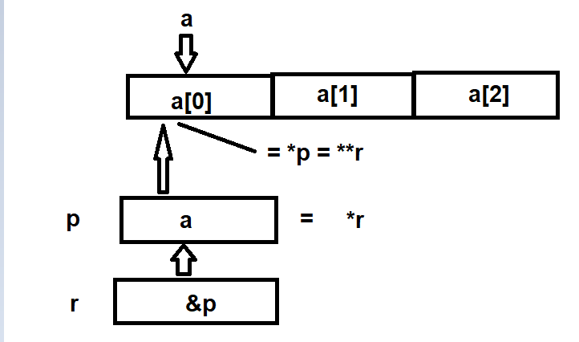

# Macros

* it's just a plain text reolacement
* have no type checking
* have no return statement
* faster in context of execution because there's no invokation (actually), it's just replaced with the code
```c
#define MULTIPLY(X, Y)  X * Y

int main(void){
    int x = 3, y = 5;
    int z = MULTIPLY(x, y);
}
```
this code will pass through the preprocessor (before the compiler) and will output the next file ```.i``` which will be actually compiled by the compiler
```c
int main(void){
    int x = 3, y = 5;
    int z = x * y;
}
```
so the problem here is that if we do this
```c
#define MULTIPLY(X, Y)  X * Y

int main(void){
    int x = 3, y = 5;
    int z = MULTIPLY(x, y + 1);
}
```
this will let ```z = x * y + 1``` which is 16, although we meant to multiply ```x * (y + 1)``` which is 18, that's the main problem of plain text replacement

* Not compiled (preprocessed)
* hard to debug. why?

1)
```c
#include<stdio.h>
#define MULTIPLY(X, Y)    do{\
                        m = X * Y;\
                        printf("%d", m);\
                        }\
                        while(0);
int main(){
    int m;
    MULTIPLY(5, 8);
}
```
this will be replaced with
```c
int main(){
    int m;
    do{m = X * Y; printf("%d", m);}while(0);        /* this line contain three different statements */
}
```
and as the debugger goes line by line, it's hard to detect where would be the error in such one line, so that macros are meant to be 1 line or 2 maximum

2)

this will replace each macro used in the  code, thus if the macro code contain an error, this error now spreaded along the whole code and cannot be referred to one location, so take care.

* one advantage (which is not used except in **autocode generation**) is the **text concatenation
```c
#define WRAP(MODULE_NAME, COMPONENT)    MODULE_NAME##_##COMPONENT

int main(void){
    int WRAP(GPIO, IDR) = 0x41;
}
```
this will result in
```c
int main(void){
    int GPIO_IDR = 0x41;
}
```

Macros | inline functions | functions
-----------|-----------|----------------
test replacement | object replacement | function context calling
no type checking | type check | type check
no return | return | return
Fastest | Faster | slower
not compiled | compiled | compiled
hard to debug | easier | easier
can concatenate text | cannot | cannot
more code size | more code size | less code size
no context switching | depend of compiler optmization | context switching

# Pointers

## what is a pointer

so, why use pointers? **to access memory chunks using addresses**, done, that's it. let's expand this definition into three use cases


* pass/share variables by address.
    * so instead of passing the value of the variable to a local variable to some function, we will pass the address to make that function be able to access the original address value through it
```c
#include <stdio.h>

void increaseValue(int * ptr){
    *ptr = *ptr + 1; 
}
int main()
{
    int x = 0;
    printf("x = %d \n", x);
    increaseValue(&x);
    printf("x = %d", x);
    return 0;
}
```
```
x = 0 
x = 1
```
* pass/share large size of data (e.g. arrays, structs...etc) by address
```c
#include <stdio.h>

void increaseValue(int * parr){
    for(int i = 0; i < 1000; i++){
        parr[i]++;
    }
}
int main()
{
    int x[1000] = {1, 2, 3, 4};     /* 1 2 3 4 0 0 0 0 ... */
    printf("x[0] = %d  x[1] = %d  x[2] = %d  x[3] = %d \n", x[0], x[1], x[2], x[3]);
    increaseValue(x);
    printf("x[0] = %d  x[1] = %d  x[2] = %d  x[3] = %d \n", x[0], x[1], x[2], x[3]);
    return 0;
}
```
```
x[0] = 1  x[1] = 2  x[2] = 3  x[3] = 4 
x[0] = 2  x[1] = 3  x[2] = 4  x[3] = 5 
```
* access peripherals registers (which is mapped in the memory to some addresses) by address

## Questions
> WARNING: you must see the lecture record before proceeding

try to answer the next questions yourself without seeing the answer then check the answer

-------------

what is the output of the following
---
```c
#include <stdio.h>

int main()
{
    int x = 5;
    int* px = &x;
    printf("%x", *px);

    return 0;
}
```
```
5
```
---
```c
#include <stdio.h>

int main()
{
    int x = 5;
    int* px;
    px = x;
    printf("%x", *px);

    return 0;
}
```
the ```px = x``` assignment isn't correct, this assignment leads to a pointer pointing to location ```0x00000005``` in memory, thus the behavior of accessing this location using ```*px``` is undefined it may cause a runtime error or just print some garbage value

the correct assignment is ```px = &x```

---

this question focus on the fact that ```int* px = &x;``` doesn't equal ```char* px = &x;``` doesn't equal ```unsigned char* px = &x;``` etc...

the right way to think about that is as following, consider the example
```c
int main(void){
    int x;
    unsigned char* px = &x;
}
```
here, the ```unsigned char*``` defines the datatype that the pointer ```px``` think he is pointing at, despite the fact that the data of x is integer value no matter how the pointer see it, but if we are dealing with ```x``` through it's pointer as ```*px```, it will be the datatype the pointer think the value is

so a pointer ```unsigned char* px``` is a pointer to **unsigned characters** despite the real data it's pointing at 

we can change the pointer type to **pointer to int** or **pointer to long** or whatever using **explicit casting** as we did with any other native datatypes, so if we accessed the px as ```*(int*)px```, it will be used as integer value, despite the definition of it as pointer to unsigned char.

> fact: we can ever discard the ```px``` variable and use the address of x directly to access it as a pointer, like ```*(char*)0x00000800```, this method is used to define (#define) the mcu registers using their addresses to be able to be accessed without physically assign a pointer variable

so the Question is:

```c
#include <stdio.h>

int main()
{
    int x = 501;
	char y = 201;		/* which will be converted to -55 and be stored in y */
	char* py = &y;
    int* px = &x;    
    printf("%p\n", px);	/* print the address of x var */
	printf("%d\n", *px);	/* print the 4 bytes pointed by the address assigned in px */	
	printf("%d\n", *(char*)px);	/* print the 1 byte(signed) pointed by the address assigned in px */
	printf("%d\n", *(unsigned char*)px);	/* print the 1 byte(unsigned) pointed by the address assigned in px */
	printf("%d\n", *py);		/* print the 1 byte(signed) pointed by the address assigned to py */
	printf("%d\n", *(int*)py);	/* print the 4 bytes pointed by the address assigned in py */
	
    return 0;
}
```
```
000000000061FE0C
501
-11
245
-55
128457
```

---
the following questions about pointer to pointer

```c
#include <stdio.h>

int main()
{
	int x = 5;
	int* px = &x;
	int** ppx = &px;
	printf("%d   %d     %d",x, *px, **ppx);
    return 0;
}
```
```
5     5        5
```
Note: you can create **unlimited pointers to a one address**, and you can create **unlimited pointers to pointers to pointers to infinitly**...

---

```c
#include <stdio.h>

int main()
{
	int x = 5;
	int* px = &x;
	int* ppx = &px;
	printf("%d   %d     %d",x, *px, **ppx);
    return 0;
}
```
```
main.c:8:34: error: invalid type argument of unary '*' (have 'int')
  printf("%d   %d     %d",x, *px, **ppx);
                                  ^~~~~
```

a pointer to pointer must be defined with ```**``` not one

---

```c
#include <stdio.h>

int main()
{
	int x = 5;
	int* px = &x;
	int** ppx = &x;
	printf("%d   %d     %d",x, *px, **ppx);
    return 0;
}
```
**undefined behavior** or **runtime error**

choose either the answers in mcq

---

```c
#include <stdio.h>

int main()
{
	int x = 5;
	int* px = &x;
	int** ppx = &x;
	printf("%d   %d     %d",x, *px, *ppx);
    return 0;
}
```
```
5      5     5
```

---

```c
    #include <stdio.h>
    void main()
    {
        int a[3] = {1, 2, 3};
        int *p = a;
        int *r = &p;
        printf("%d", (**r));
    }
```
* a) 1
* b) Compile time error
* c) Address of a
* d) Junk value

answer: b

---
```
    #include <stdio.h>
    void main()
    {
        int a[3] = {1, 2, 3};
        int *p = a;
        int **r = &p;
        printf("%p %p", *r, a);
    }
```
hint: the name of an array is the first address in the array as well, thus ```a = address of a[0]```

* a) Different address is printed
* b) 1 2
* c) Same address is printed
* d) 1 1

answer: c

explanation:


---

```c
    #include <stdio.h>
    int main()
    {
        int a = 1, b = 2, c = 3;
        int *ptr1 = &a, *ptr2 = &b, *ptr3 = &c;
        int **sptr = &ptr1; //-Ref
        *sptr = ptr2;
    }
```
* a) ptr1 points to a
* b) ptr1 points to b
* c) sptr points to ptr2
* d) none of the mentioned

answer: b

explanation:


