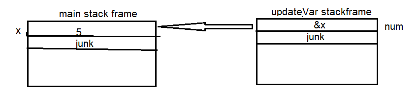

# pointers

## call by value and call by address

### simpe variable case

consider the following

```c
#include <stdio.h>

updateVar(int num){
    num++;
}

int main(void){
    int x = 5;
    updateVar(x);

    print("%d", x);
}
```

this is call by value, where you pass the value 5 to the argument ```int num``` in the **updateVar stackframe**

so if we want to make the x var accessable to the function, we pass the address of the x to a pointer argument in the function to be able to access it

like the following

```c
#include <stdio.h>

updateVar(int* num){
    (*num) ++;
}

int main(void){
    int x = 5;
    updateVar(&x);

    print("%d", x);
}
```

now the ```updateVar``` function have access on ```x``` variable in the main function



inspect the error reason in the following, and state the correct code

```c
#include <stdio.h>

updateVar(int num){
    (*num) ++;
}

int main(void){
    int x = 5;
    updateVar(&x);

    print("%d", x);
}
```

answer: ```int num``` must be ```int* num```

### arrays case

consider the following example

```c
void updateArr(int arr[]){
    arr[0] = 2;
    arr[1] = 3;
    arr[2] = 5;
    printf(" %d", sizeof(arr));
}

int main(){
    int x[3];
    printf("%d", sizeof(x));
    updateArr(x);
    return 0;
}
```
```
12 4
```
note: that ```sizeof``` is a macro defined to return the size of the variable in bytes

note: ```x``` is the first address of the array, thus ```x = address of x[0]```

so as the output shows, an array passed to a function is treated as a pointer, it can be defined as argument in either ```int arr[]``` or ```int* arr```, the two are valid only for arrays. also you can access arr's values using ```arr[index]``` or ```*(arr + index)```, both are valid for accessing data from pointers

> note that the sizeof for any pointer to any datatype is always 4. some machines store it in 8 bytes

what is the output of the following

```c
#include "stdio.h"

void updateArr(int* arr){
    *(arr + 1) = 2;     /* equivalent to arr[1] */
    arr[2] = 3;
	*arr++;     /* no ++ happens here for the value */
	arr++;     /* no ++ happens here for the value */
	*arr = *arr + 1;  /* equivalent to arr[2] + 1 */
}

int main(){
    int x[3] = {1};
    updateArr(x);
	printf(" %d     %d     %d", x[0], x[1], x[2]);
    return 0;
}
```
```
 1     2     4
```
I will explain ```*arr++```, in ```*arr++``` statement, ```++``` have a higher priority than the dereference operator ```*```, thus, the ```arr++``` gets executed first then we dereference the result


### functions case


### pointers case

what if we want 

# questions out of context

what is the output, assuming that x++ use the accumulator to perform the increment

```c
#include <stdio.h>

updateVar(int x){
    x++;
}

int main(void){
    int x = 5;
    x = updateVar(x);

    print("%d", x);
}
```
* a. compilation error
* b. garbage value
* c. 6
* d. 5

answer: 6

---
```c
#include <stdio.h>

int main(void){
    char x[3];

    printf("%d  %d  %d", x, &x, &x[0]);
    return 0;
}
```

answer: print the same address (address of the first element in arr)
* ```x```: the name of array return the address of it's first element
* ```&x```: the reference to an array name return the address of the start of array (which is the same as x)
* ```&x[0]```: address of the first element of array

> are they the same?

> as value, yes. as pointer arithmetic operations, NO

consider this example
```c
#include <stdio.h>

int main(void){
    char x[3];

    printf("%d  %d  %d\n", x, x + 1, x + 2);
    printf("%d  %d  %d\n", &x, &x + 1, &x + 2);
    printf("%d  %d  %d", &x[0], &x[0] + 1, &x[0] + 2);
    return 0;
}
```
```
6422045  6422046  6422047
6422045  6422048  6422051
6422045  6422046  6422047
```

> recall these:
> * ```x```: points to first element
> * ```&x```: points to array
> * ```&x[0]```: points to first element

we can simulate them as the following

> * ```char* pe = x```: pointer to first array element of char type
> * ``` char (*parr)[3] = &x```: pointer to array of 3 element of char type
> * ```char pe = &x[0]```: pointer to first array element of char type

consider this example
```c
#include <stdio.h>

int main(void){
    char x[3];

    char* pe = x;   /* pointer to char */
    char (*parr)[3] = &x;       /* pointer to arr of 3 elements */
    char* pe[3] = &x[0];      /* array of pointers to char */

    printf("%d  %d  %d\n", pe, pe + 1, pe + 2);
    printf("%d  %d  %d\n", parr, parr + 1, parr + 2);
    printf("%d  %d  %d", pe[0], pe[1], pe[2]);
    return 0;
}
```
```
6422045  6422046  6422047
6422045  6422048  6422051
6422045  6422046  6422047
```